[Portfolio](https://mesumitsingh.netlify.app/) &nbsp;·&nbsp;
[LinkedIn](https://www.linkedin.com/in/mesumitsingh/) &nbsp;·&nbsp;
[Instagram](https://www.instagram.com/sumit.zl/) &nbsp;·&nbsp;
[GitHub](https://github.com/mesumitsingh) &nbsp;·&nbsp;
[Email](mailto:mesumitkumarsk@hotmail.com)

---

> HEY👋! I'm Sumit Sengar a CSE student & a passionate Developer from India, exploring the world of AI and ML. 
I enjoy creating innovative projects using the web and native technologies to build solutions for real-world problems! 
> Passionate about building practical software that solves real-world problems.

I love turning ideas into products by combining software engineering with AI.

Currently interested in:

- 🤖 Artificial Intelligence & Machine Learning
- 🧠 AI Agents & Generative AI
- 🌐 Full Stack Development
- ☁️ Cloud Computing (AWS & Google Cloud)
- 📱 Android & Cross-platform Apps
- 💻 Data Structures & Algorithms
- 🚀 Open Source

---

<samp>

Java &nbsp;
Python &nbsp;
JavaScript &nbsp;
TypeScript &nbsp;
Kotlin &nbsp;
Dart &nbsp;
Flutter &nbsp;
React &nbsp;
Spring Boot &nbsp;
Node.js &nbsp;
Firebase &nbsp;
MongoDB &nbsp;
MySQL &nbsp;
Git &nbsp;
Linux &nbsp;
AWS &nbsp;
Google Cloud

</samp>

---

### YouTube Trending Video Data Pipeline
<samp>AWS S3 • AWS Glue • AWS Lambda • Athena • QuickSight • IAM</samp>

End-to-end AWS data pipeline that ingests raw YouTube trending-video data (CSV/JSON) from multiple regions into a centralized S3 data lake, transforms it via Glue ETL jobs, and serves it through Athena for serverless SQL querying and QuickSight for BI dashboarding, with IAM-managed secure access.

**[View on GitHub →](https://github.com/mesumitsingh/de-youtube-project-analysis)**

---

### RAG-based Document Q&A System
<samp>Python • LangChain • ChromaDB</samp>

Retrieval-Augmented Generation pipeline using LangChain and ChromaDB (vector database) for semantic search and LLM-based question answering over enterprise documents.

**[View on GitHub →](https://github.com/mesumitsingh/learning-rag)**

---

### Research Agentic AI
<samp>Python • LangChain • LLM Agents</samp>

Autonomous LLM agent that plans its own steps for web research — tool calling, retrieval, summarization, and structured report generation — with no manual intervention between steps.

**[View on GitHub →](https://github.com/mesumitsingh/research-agentic-ai)**

---

### ATS-Friendly Resume Builder
<samp>Python • Markdown • PDF</samp>

Python tool that automates ATS-compatible resume generation from Markdown templates via PDF conversion APIs, removing manual formatting work.

**[View on GitHub →](https://github.com/mesumitsingh)**

---

### More Projects

Explore everything I've built:

**https://github.com/mesumitsingh**

---

---

🏆 AWS Certified Cloud Practitioner

☁️ Google Cloud Skill Badges

🥇 Hackathon Participant

🚀 Open Source Contributor

💻 Competitive Programmer

🧩 Data Structures & Algorithms Enthusiast

🤖 AI & ML Developer

📚 Computer Science Engineering Student

---

I'm currently working on:

- 🤖 AI Agents & Autonomous Systems
- 🧠 Generative AI Applications
- 💬 Large Language Model Integrations
- ☁️ Cloud-based Applications
- 🚀 Open Source Contributions
- 💻 Daily LeetCode & DSA Practice
- 📖 System Design & Backend Development

---

### Thanks for stopping by! 👋

Connect with me on [LinkedIn](https://www.linkedin.com/in/mesumitsingh/) <3  
May your builds stay green, your merge conflicts be someone else's problem, and your production never seen.

